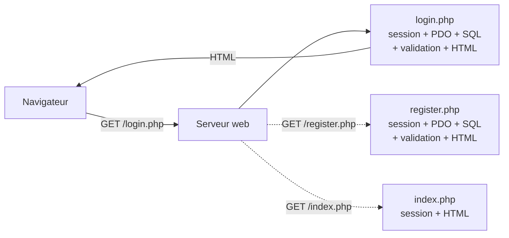
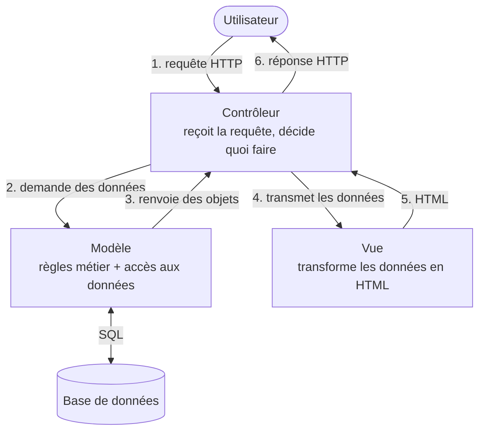
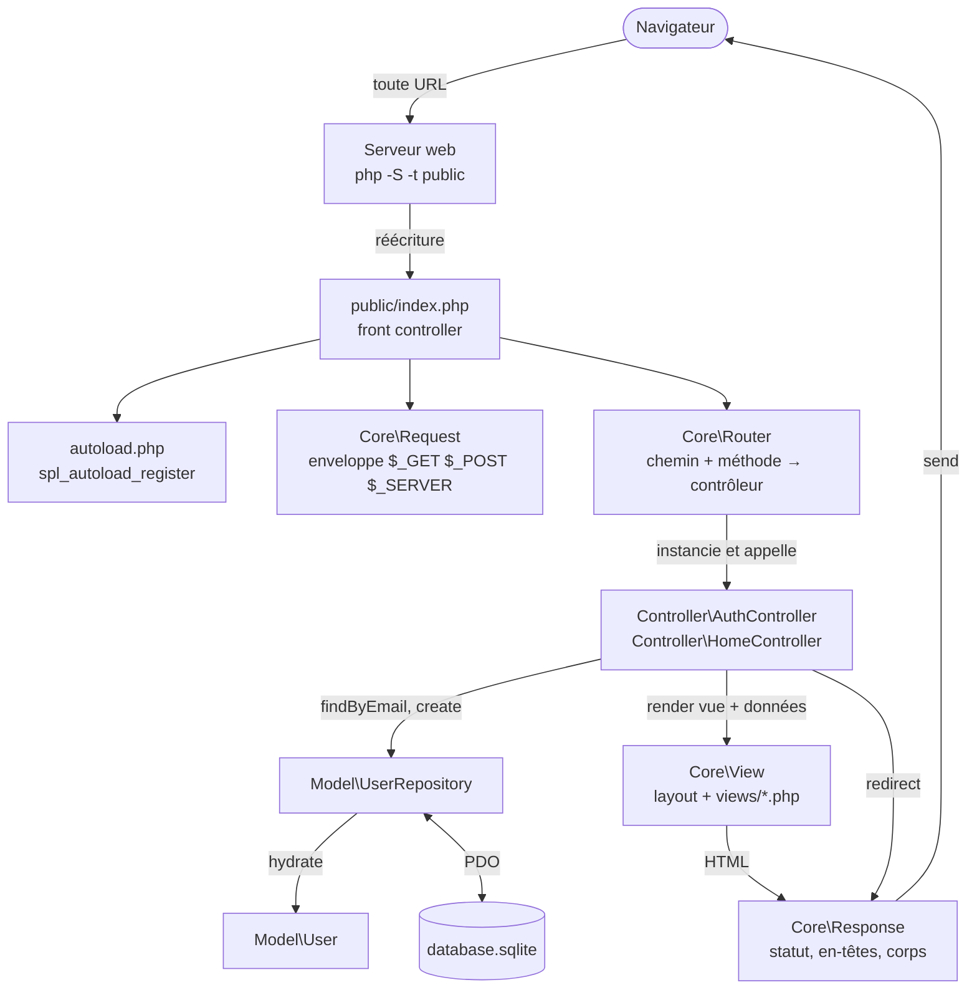
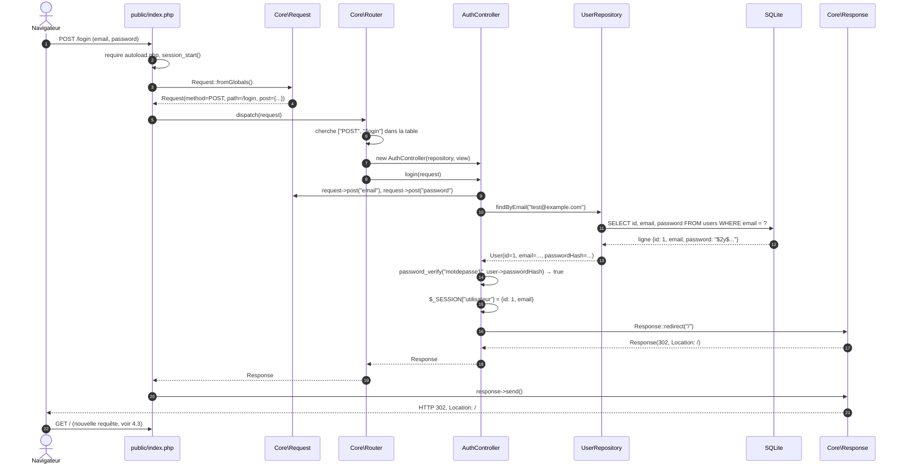
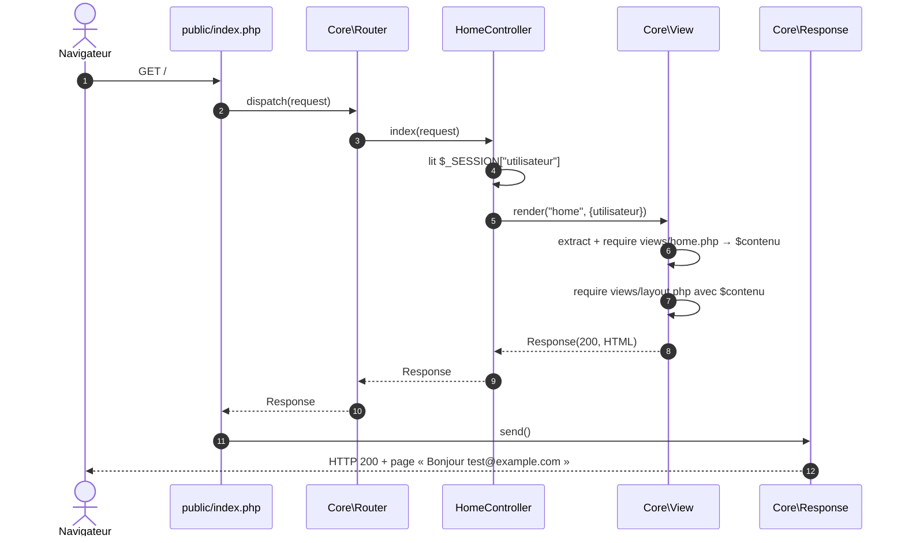
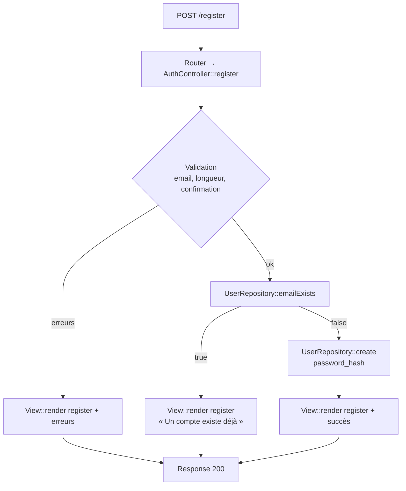
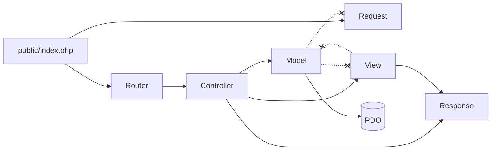

# Le MVC expliqué en diagrammes

Ce document décrit l'architecture cible du projet (étape 9, avant le moteur de templates de l'étape 10) et suit une requête réelle de bout en bout.
Les diagrammes sont en Mermaid (rendus par GitHub et PhpStorm) avec une version texte en dessous.

---

## 1. Avant : une URL, un fichier

En PHP classique, le serveur web fait correspondre directement l'URL à un fichier. Chaque fichier fait tout.



```
Navigateur ──GET /login.php──► Serveur web ──► login.php ──► HTML
                                              (session, PDO, SQL, validation, HTML : tout dedans)
```

Conséquences : code dupliqué, HTML et logique mélangés, tous les fichiers du projet sont accessibles par URL.

---

## 2. Les trois rôles du MVC



```
              1. requête               2. demande
Utilisateur ───────────► Contrôleur ───────────► Modèle ◄──SQL──► Base
     ▲                       │   ▲                  │
     │                       │   └──── 3. objets ───┘
     │                       │ 4. données
     │                       ▼
     └──── 6. réponse ─── Vue (HTML) ── 5. HTML ──► Contrôleur
```

| Rôle | Responsabilité | Ne doit jamais | Dans ce projet |
|---|---|---|---|
| **Modèle** | Représenter les données et les règles métier, dialoguer avec la base | Produire du HTML, lire `$_POST` | `App\Model\User`, `App\Model\UserRepository` |
| **Vue** | Transformer des données en HTML | Faire du SQL, lire `$_POST` ou `$_SESSION`, décider | `views/*.php`, `App\Core\View` |
| **Contrôleur** | Lire la requête, appeler le modèle, choisir la vue, construire la réponse | Contenir du SQL ou du HTML | `App\Controller\AuthController`, `HomeController` |

Ce que le schéma classique ne montre pas : quelqu'un doit recevoir la requête et choisir le contrôleur. C'est le rôle du **front controller** et du **routeur**.

---

## 3. L'architecture complète du projet



```
Navigateur
   │  n'importe quelle URL
   ▼
Serveur web (php -S -t public) ── réécrit tout vers ──► public/index.php   ◄── FRONT CONTROLLER
                                                            │
                          ┌─────────────────────────────────┼─────────────────────┐
                          ▼                                 ▼                     ▼
                     autoload.php                     Core\Request           Core\Router
                  (charge les classes                (enveloppe les          (table des routes)
                   à la demande)                      superglobales)               │
                                                                                   │ dispatch
                                                                                   ▼
                                                               Controller\AuthController
                                                                  │                │
                                        Model\UserRepository ◄────┘                └────► Core\View
                                              │  hydrate                                    │ layout + vue
                                              ▼                                             ▼
                                         Model\User                                    Core\Response ──► Navigateur
                                              ▲
                                              │ PDO
                                        database.sqlite
```

Arborescence correspondante :

```
MVC-Explication/
├── public/
│   └── index.php            ← seul fichier accessible par le web
├── autoload.php
├── .env                     ← non versionné : DB_DSN=sqlite:database.sqlite
├── .env.example             ← versionné : mêmes clés, valeurs d'exemple
├── config/
│   └── routes.php           ← table des routes
├── src/
│   ├── Core/
│   │   ├── Router.php
│   │   ├── Request.php
│   │   ├── Response.php
│   │   ├── View.php
│   │   └── Database.php
│   ├── Controller/
│   │   ├── AuthController.php
│   │   └── HomeController.php
│   └── Model/
│       ├── User.php
│       └── UserRepository.php
├── views/
│   ├── layout.php
│   ├── home.php
│   ├── login.php
│   └── register.php
└── database.sqlite          ← hors de public/, donc inaccessible par URL
```

---

## 4. Exemple complet : `POST /login`

L'utilisateur a saisi `test@example.com` et `motdepasse1` dans le formulaire, puis cliqué sur « Se connecter ».

### 4.1 Diagramme de séquence



### 4.2 La même requête, fichier par fichier

**Étape 1 : le serveur web reçoit la requête**

```
POST /login HTTP/1.1
Host: localhost:8000
Cookie: PHPSESSID=abc123
Content-Type: application/x-www-form-urlencoded

email=test%40example.com&password=motdepasse1
```

`/login` ne correspond à aucun fichier dans `public/`. Le serveur (via `php -S -t public` et un `router.php`,
ou `.htaccess` sous Apache) envoie donc la requête à `public/index.php`.

**Étape 2 : `public/index.php`, le front controller**

```php
<?php
declare(strict_types=1);

require dirname(__DIR__) . '/autoload.php';   // 1. les classes se chargeront toutes seules

session_start();                              // 2. une seule fois, pour tout le site

use App\Core\{Database, Request, Router, View};
use App\Model\UserRepository;

$pdo        = Database::connexion();          // 3. dépendances partagées (Database lit DB_DSN dans .env)
$repository = new UserRepository($pdo);
$view       = new View(dirname(__DIR__) . '/views');

$router = new Router(require dirname(__DIR__) . '/config/routes.php');

$request  = Request::fromGlobals();           // 4. la requête devient un objet
$response = $router->dispatch($request, [$repository, $view]);   // 5. le routeur trouve et appelle le contrôleur

$response->send();                            // 6. un seul endroit qui écrit la sortie
```

**Étape 3 : `autoload.php`**

Aucune classe n'est chargée pour l'instant. Au premier `new Request`, PHP ne connaît pas `App\Core\Request`
et appelle la fonction enregistrée, qui transforme le nom en chemin :

```
App\Core\Request  →  retire "App\"  →  Core\Request  →  remplace \ par /  →  src/Core/Request.php
```

```php
<?php
spl_autoload_register(function (string $classe): void {
    $prefixe = 'App\\';
    if (!str_starts_with($classe, $prefixe)) {
        return;
    }
    $fichier = __DIR__ . '/src/' . str_replace('\\', '/', substr($classe, strlen($prefixe))) . '.php';
    if (is_file($fichier)) {
        require $fichier;
    }
});
```

Chaque classe est chargée une seule fois, au moment de sa première utilisation.

**Étape 4 : `Core\Request` enveloppe les superglobales**

```php
final class Request
{
    public function __construct(
        public readonly string $method,
        public readonly string $path,
        private readonly array $get,
        private readonly array $post,
    ) {}

    public static function fromGlobals(): self
    {
        $path = parse_url($_SERVER['REQUEST_URI'], PHP_URL_PATH) ?: '/';
        return new self($_SERVER['REQUEST_METHOD'], rtrim($path, '/') ?: '/', $_GET, $_POST);
    }

    public function post(string $cle, ?string $defaut = null): ?string
    {
        return $this->post[$cle] ?? $defaut;
    }
}
```

État de l'objet : `method = "POST"`, `path = "/login"`, `post = ["email" => "test@example.com", "password" => "motdepasse1"]`.

**Étape 5 : `Core\Router` trouve le contrôleur**

Table des routes (`config/routes.php`) :

```php
return [
    ['GET',  '/',         [HomeController::class, 'index']],
    ['GET',  '/login',    [AuthController::class, 'loginForm']],
    ['POST', '/login',    [AuthController::class, 'login']],      // ← celle-ci
    ['GET',  '/register', [AuthController::class, 'registerForm']],
    ['POST', '/register', [AuthController::class, 'register']],
    ['GET',  '/logout',   [AuthController::class, 'logout']],
];
```

```php
public function dispatch(Request $request, array $dependances): Response
{
    foreach ($this->routes as [$methode, $chemin, [$classe, $action]]) {
        if ($methode === $request->method && $chemin === $request->path) {
            $controleur = new $classe(...$dependances);     // autoload.php charge AuthController ici
            return $controleur->$action($request);
        }
    }
    return Response::notFound();
}
```

Le routeur compare `POST` et `/login` ligne par ligne, s'arrête à la troisième, instancie `AuthController`
et appelle sa méthode `login()`.

**Étape 6 : `Controller\AuthController::login()` orchestre**

```php
public function login(Request $request): Response
{
    $email    = trim($request->post('email', ''));
    $password = $request->post('password', '');

    $user = $this->repository->findByEmail($email);              // → Modèle

    if ($user === null || !password_verify($password, $user->passwordHash)) {
        return $this->view->render('login', [                    // → Vue, statut 200
            'erreur' => 'Email ou mot de passe incorrect.',
            'email'  => $email,
        ]);
    }

    $_SESSION['utilisateur'] = ['id' => $user->id, 'email' => $user->email];
    return Response::redirect('/');                              // → Réponse 302
}
```

Le contrôleur ne contient ni SQL ni HTML. Il lit, délègue, décide, répond.

**Étape 7 : `Model\UserRepository::findByEmail()` interroge la base**

```php
public function findByEmail(string $email): ?User
{
    $stmt = $this->pdo->prepare('SELECT id, email, password FROM users WHERE email = :email');
    $stmt->execute(['email' => $email]);
    $ligne = $stmt->fetch(PDO::FETCH_ASSOC);

    return $ligne ? new User((int) $ligne['id'], $ligne['email'], $ligne['password']) : null;
}
```

SQLite renvoie une ligne, le repository la transforme en objet `User`. Le contrôleur ne sait pas
qu'il s'agit de SQLite, ni même de SQL.

**Étape 8 : `Core\Response` termine**

```php
public static function redirect(string $url): self
{
    return new self(302, '', ['Location' => $url]);
}

public function send(): void
{
    http_response_code($this->statut);
    foreach ($this->entetes as $nom => $valeur) {
        header("$nom: $valeur");
    }
    echo $this->corps;
}
```

La réponse remonte jusqu'à `public/index.php`, qui appelle `send()`. C'est le seul endroit du projet où
`header()` et `echo` sont exécutés pour la sortie finale.

```
HTTP/1.1 302 Found
Location: /
Set-Cookie: PHPSESSID=abc123
```

### 4.3 Suite : le navigateur suit la redirection avec `GET /`



Le point intéressant est `Core\View` : elle exécute d'abord la vue dans un tampon de sortie, puis insère
le résultat dans le layout commun.

```php
public function render(string $vue, array $donnees = [], int $statut = 200): Response
{
    $contenu = $this->capturer("$vue.php", $donnees);
    $html    = $this->capturer('layout.php', ['contenu' => $contenu, 'titre' => $donnees['titre'] ?? '']);
    return new Response($statut, $html);
}

private function capturer(string $fichier, array $donnees): string
{
    extract($donnees, EXTR_SKIP);
    ob_start();
    require $this->dossier . '/' . $fichier;
    return ob_get_clean();
}
```

```
views/home.php ──(HTML partiel)──► $contenu ──► views/layout.php ──(page complète)──► Response
```

---

## 5. Le chemin d'erreur : `POST /register` avec un email déjà pris

Même mécanique, autre issue. Ce diagramme montre que le contrôleur choisit **une vue** ou **une redirection**
selon ce que lui dit le modèle.



---

## 6. Qui connaît qui ?

Le sens des flèches est la règle la plus importante du MVC : les dépendances vont toujours dans le même sens.



```
index.php ──► Router ──► Controller ──► Model ──► PDO
                            │  └──────► View ──► Response
                            └─────────────────► Response

Interdits :   Model ✗──► View      View ✗──► Model      Model ✗──► Request / $_POST
```

- Le **modèle** ne connaît ni la vue, ni la requête HTTP. On peut l'utiliser depuis un script en ligne de commande.
- La **vue** ne connaît que les données qu'on lui donne. On peut la remplacer par du JSON sans toucher au reste.
- Le **contrôleur** connaît tout le monde, mais ne fait rien lui-même : il coordonne.

---

## 7. Résumé en une phrase par composant

| Composant | En une phrase |
|---|---|
| Serveur web | Envoie toute URL vers `public/index.php`. |
| Front controller | Prépare les dépendances, construit la `Request`, délègue au routeur, envoie la `Response`. |
| Autoloader | Transforme un nom de classe en chemin de fichier et le charge à la première utilisation. |
| Request | Rend la requête HTTP lisible et testable, sans superglobale. |
| Router | Associe méthode HTTP et chemin à une méthode de contrôleur. |
| Contrôleur | Lit la requête, appelle le modèle, choisit vue ou redirection. |
| Modèle | Porte les règles métier et parle à la base ; ignore le web. |
| Vue | Transforme des données en HTML ; ignore d'où elles viennent. |
| Response | Porte statut, en-têtes et corps ; envoyée une seule fois, à la fin. |
